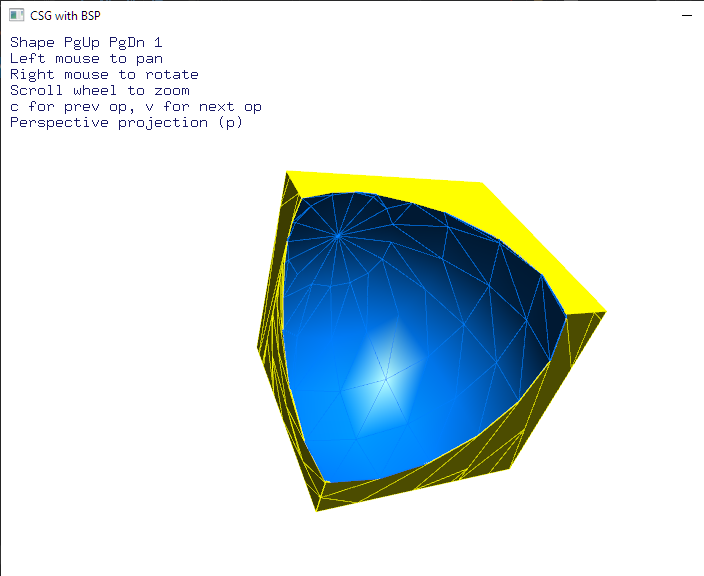

# csg.hpp

What:
====
 A port of the csg.js constructive solid geometry library to C++11.

 Why?
 ====
 Because I wanted to better understand the original js code.
 Noticed later that there is another, better C++ port at
 https://github.com/executionunit/csgjs-cpp

 How to build:
 ==========
 $ g++ -O2 -o demo demo.cpp -lm -lopengl32 -lfreeglut

 References:
 ===========
 original javascript library [csg.js](https://github.com/evanw/csg.js/) from evanw
 For the demo, 
	[arcball camera](https://github.com/nlguillemot/arcball_camera) from nlguillemot
	[freeglut](https://github.com/FreeGLUTProject)

 Example use:
 ===========

	#include "csg.cpp"

	auto a = CSG::cube(vec3(-.25, -.25, -.25));
	auto b = CSG::sphere(vec3(.25, .25, .25), 1.3);

	a.setColor(1, 1, 0);
	b.setColor(0, 0.5, 1);
	auto c = a.subOp(b);

	// Do something with polygons in C.

Screenshot from demo:

